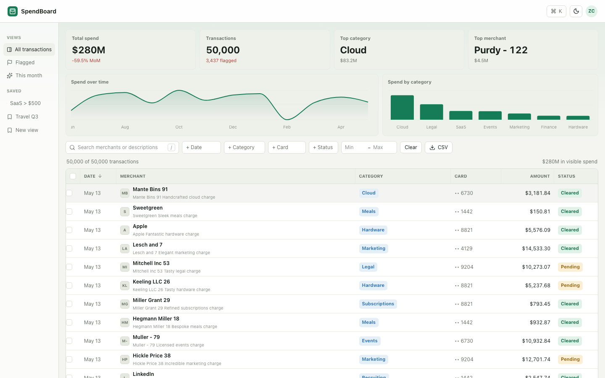
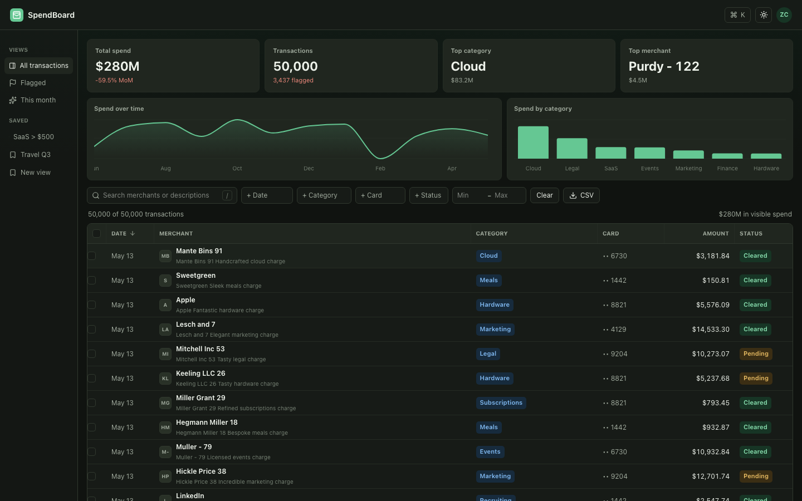
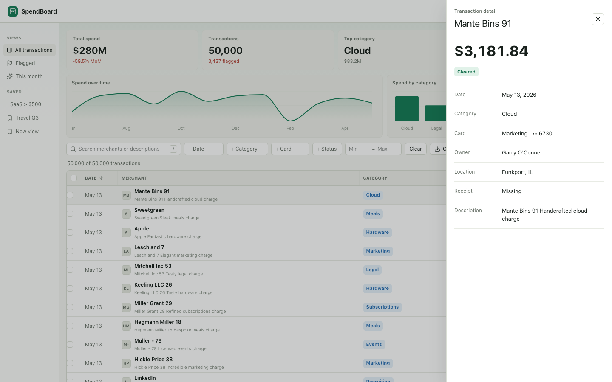
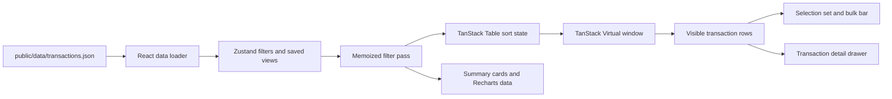

# SpendBoard

A high-performance spend management dashboard demonstrating sub-second interactions on 50,000+ transactions. Built with React, TypeScript, and Vite. Inspired by Ramp, Brex, and Mercury.

**[Live demo ->](https://spendboard.vercel.app)** · **[30-second walkthrough ->](https://www.loom.com/share/your-loom-id)**

> Note: replace the demo and Loom URLs after the Vercel deployment and walkthrough are live.

## Screenshots





## What This Is

Most spend dashboards either fake their scale with a handful of rows or buckle once a table hits real operational volume. SpendBoard renders 50,000 transactions with filtering, multi-column sorting, keyboard navigation, selection, saved views, charts, and a detail drawer while keeping the table interaction fast.

It is intentionally a showcase, not a platform. No auth, no backend, no account model. The table is the product surface.

## Features

- Virtualized table rendering 50,000 rows with TanStack Virtual
- TanStack Table sorting with shift-click multi-sort
- Filters for date, category, card, amount, status, and merchant/description search
- Linear-style active filter chips with one-click clear
- Saved views persisted to localStorage with a narrow sidebar
- Click, shift-click, and cmd/ctrl-click row selection with a floating bulk-action bar
- Right-side transaction detail drawer
- Summary cards, Recharts spend charts, and category click-to-filter
- Light/dark mode
- Keyboard shortcuts for search, command palette, row movement, and detail opening
- CSV export for the current filtered view or selected rows
- Polished loading, empty, and error states

## Performance Notes

The first working version imported the generated 50k JSON file directly into the React bundle. It was convenient, but it made the production JavaScript jump past 21 MB before gzip. That is exactly the kind of "demo works locally, feels rough in public" mistake this project is supposed to avoid. The dataset now lives at `public/data/transactions.json`, still committed and instant to serve, but loaded as a static asset so the application bundle stays focused on UI code.

Virtualization is doing the heavy lifting for scroll performance. The table only mounts the visible rows plus a small overscan window, and each row has stable 44px dimensions so the virtualizer can avoid repeated measurement work. I kept hover styling in CSS and selection state as a `Set` keyed by transaction ID so pointer movement does not trigger React updates across the table.

Filtering 50k rows stays on the main thread because the dataset size does not justify worker serialization overhead. The filter pass is straightforward: normalize the query once per render, build sets for categorical filters, and return early for the cheapest checks. If this were 500k rows, I would move search and aggregation into a worker and keep the virtual table as the rendering boundary.

One surprise: the chart row mattered for perceived speed. Recharts is not the bottleneck, but it is still expensive enough that the chart data is memoized from the filtered row set. That keeps typing in the search field from feeling like the whole dashboard is repainting.

## Architecture



## Stack

| Area | Choice | Rationale |
|---|---|---|
| Build | Vite | Fast local loop and portfolio-friendly deployment path |
| Language | TypeScript | Typed data model, filters, and table state |
| UI | React | Matches the target frontend roles and table ecosystem |
| Table state | TanStack Table | Sorting primitives without owning rendering |
| Virtualization | TanStack Virtual | Smooth 50k-row scrolling without CSS tricks |
| State | Zustand | Small persistent app state for filters, theme, and views |
| Styling | Tailwind v4 installed, app-level CSS | Fast styling with dense custom surfaces and CSS variables |
| Charts | Recharts | Lightweight enough for summary visuals |
| Animation | Framer Motion | Detail drawer and bulk action bar transitions |
| Data | Faker.js script | Deterministic 50k-row committed dataset |

## Local Setup

```bash
npm install
npm run gen:data
npm run dev
```

Visit `http://localhost:5173`.

To regenerate a larger dataset:

```bash
node scripts/generate-data.mjs --transactions 100000 --merchants 500
```

## Project Shape

```text
src/
  App.tsx              # Dashboard shell, table, filters, drawer, command palette
  data/types.ts        # Transaction, filter, saved-view types
  lib/                 # Formatting, filtering, CSV export helpers
  store/useAppStore.ts # Zustand filters, theme, saved views
public/data/
  transactions.json    # Faker-generated committed dataset
scripts/
  generate-data.mjs
```

## What I Would Build Next

- Inline category editing with optimistic updates
- Drag-to-resize columns
- A compare-two-periods view with diff highlighting
- Optional worker-backed filtering for 500k+ row experiments

Built by [Zoriah Cocio](https://zoriahcocio.com).
