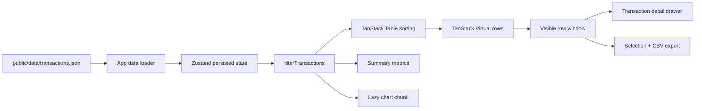

# SpendBoard Architecture

SpendBoard is a data-heavy spend management dashboard built to prove that dense operational UI can stay fast at realistic row counts. The public product surface is intentionally narrow: load 50,000 transactions, let the user filter and sort them, keep navigation responsive, and preserve a polished SaaS dashboard feel.

## Product Boundary

SpendBoard is not trying to be a full accounting system. It focuses on the highest-signal frontend problem:

- Large table rendering.
- Multi-dimensional filtering.
- Saved operational views.
- Detail inspection without leaving context.
- Bulk selection and export.
- Dashboard metrics and charts that do not block table work.

That boundary keeps the project credible as a frontend performance case study.

## Data Flow

The dataset is committed as a static asset instead of imported into the JavaScript bundle. That keeps the UI bundle focused on interaction code while still making the demo deterministic and fast to serve.

## State Model

Persistent state lives in `src/store/useAppStore.ts`:

- Current filters.
- Saved views.
- Theme.

Ephemeral interaction state stays in `src/App.tsx`:

- Sorting state.
- Loaded transactions.
- Active row index.
- Selected row IDs.
- Detail drawer state.
- Command palette state.

This split keeps localStorage small and avoids persisting table-specific transient state that would surprise users on reload.

## Filtering Strategy

Filtering stays on the main thread because 50,000 rows is below the point where worker serialization clearly pays for itself. `filterTransactions` is deliberately simple:

- Normalize the search query once.
- Convert category/card/status filters into sets.
- Return early on cheap checks.
- Keep date and amount checks straightforward and typed.

At 500,000+ rows, the next architecture step would be a Web Worker that owns filtering and aggregation while React remains the rendering layer.

## Rendering Strategy

The table uses TanStack Table for row models and TanStack Virtual for rendering. The virtualizer relies on stable row height so it can avoid expensive layout measurement during scroll. Selection is a `Set` of transaction IDs so toggling one row does not require reshaping the data model.

Charts are loaded with `React.lazy` because Recharts is useful but large enough that it should not block the initial table workflow. The table, search field, and filters become interactive before the chart chunk is needed.

## Performance Budget

Current target behavior:

- Initial app shell should load before the chart chunk is needed.
- Virtual row count should stay bounded regardless of dataset size.
- Search/filter interactions should avoid visible table jank at 50,000 rows.
- Horizontal overflow is treated as a regression on desktop and mobile.
- Production smoke tests must cover the loaded dashboard, filters, drawer, command palette, export, and layout stability.

## Testing Strategy

Unit tests cover pure data behavior:

- Filter matching and filter-chip descriptions.
- Currency, date, and display formatting.
- CSV/export helpers.

Playwright smoke tests cover user-facing risk:

- 50,000-row load.
- Search and status filters.
- Saved views.
- Transaction detail drawer.
- Bulk selection.
- Command palette.
- CSV export.
- Desktop/mobile overflow guard.

## Production Backend Target

A real SpendBoard SaaS backend would add:

- Authenticated organization/workspace model.
- Paginated transaction API with cursor or keyset pagination.
- Server-side search and filter persistence.
- Background import jobs from card providers.
- Row-level permissions for finance/admin roles.
- Audit trail for export and bulk actions.
- Warehouse-backed analytics for period comparisons.

The frontend architecture is ready for that split because the current app already separates data loading, filter logic, table rendering, and UI state.

## Interview Talking Points

- Why the dataset is fetched as a static asset instead of bundled.
- Why virtualization is the right rendering boundary for 50,000 rows.
- Why charts are lazy-loaded.
- What would move to a worker or backend at 10x scale.
- How saved views are modeled and persisted.
- How the smoke suite protects the high-risk dashboard flows.
